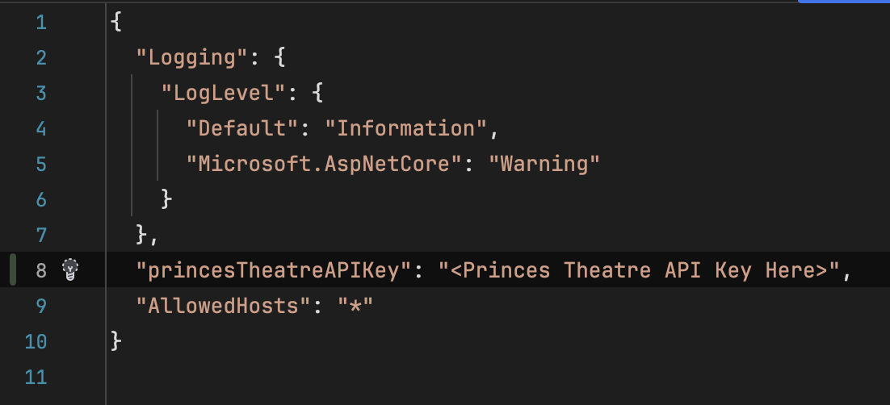

# MovieHub API - Punit Dharmadhikari

## Overview
MovieHub API provides detailed information on movies and the cinemas where they are shown. This API can retrieve movies by their attributes and provide detailed or general information based on user requests.

## Requirements

- **.NET 8.0 SDK** or later
- The project was built using [JetBrains Rider](https://www.jetbrains.com/rider/).
- **Visual Studio 2019** or later, or another compatible IDE that supports .NET development (like [VS Code with C# plugin](https://code.visualstudio.com/docs/languages/csharp))

## Setup
### Clone the repository
Start by cloning the repository to your local machine. To do this, run:

```shell
git clone https://github.com/PunitDharmadhikariLexicon/MovieHub
cd MovieHub/MovieHub
```

### Install dependencies
Ensure that all the necessary packages are restored:

```shell
dotnet restore
```

### Add configuration
Add your Princess Theatre API key to the [MovieHub/appsettings.json](MovieHub/appsettings.json) configuration file in the `PrincessTheatre.APIKey` property, as shown below.




### Configure the database
The API uses SQLite database, which will be automatically generated upon running migrations.

### Run migrations
To run migrations in the [./MovieHub/Migrations](./MovieHub/Migrations) folder, use the command:

```shell
dotnet ef database update
```

### Seeding the database
Before running the application, copy the [moviehub-db-data-seed.sql](https://github.com/Lexicon-Digital/bench-dotnet-training/blob/master/moviehub-api-implementation-task/db/moviehub-db-data-seed.sql) file into the [./MovieHub/Scripts](./MovieHub/Scripts) folder.
There is no need to manually seed the database. The database will be automatically seeded using the script upon running the application for the first time.

### Run the application
Run the application using the command (running from the `./MovieHub` directory, **not** the base directory)
```shell
dotnet run --launch-profile https
```

To run in `HTTP` mode:
```shell
dotnet run --launch-profile http
```


### Testing with Swagger
- Go to [https://localhost:7190/swagger](https://localhost:7190/swagger) or [https://localhost:5030/swagger](https://localhost:5030/swagger) (port numbers specified in [launchSettings.json](./MovieHub/Properties/launchSettings.json)).
- Test each endpoint.

### Testing with Postman
- Download and import the [MovieHub.postman_collection.json](./MovieHub.postman_collection.json) Postman collection file into Postman.
- Test each endpoint in the collection.
- **Note**: The postman collection uses `HTTPS` by default.
- You may need to turn off SSL verification in Postman settings.

- To run in `HTTP` mode, change the variable `base_url` in **collection variables** (not environment variables) to `http://localhost:5030`. Do not modify any other variable.

